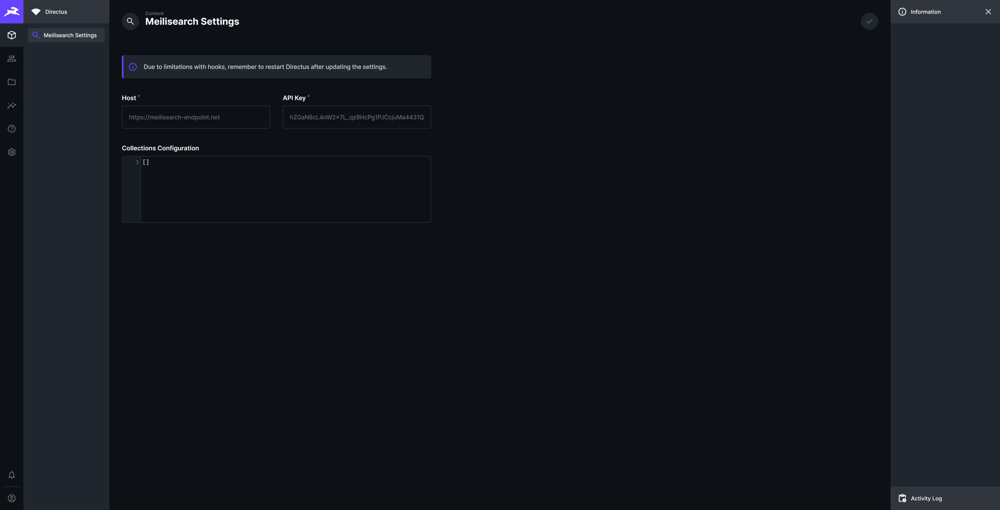

# Meilisearch integration with Directus
The extension integrates Meilisearch with Directus via hooks. Setup is configured in the "Meilisearch Settings" collection, via the content editor, and Directus has to be restarted after changes (due to limitations with hooks).

## Installation
[Enable non-sandboxed extensions]("https://docs.directus.io/extensions/marketplace/publishing.html#extension-types") in the Marketplace, by adding the environment variable "MARKETPLACE_TRUST: all" in the docker-compose file.
Or refer to the [Official Guide]("https://docs.directus.io/extensions/installing-extensions.html#installing-via-the-npm-registry") for details on installing the extension manually.

## Usage
Once the extension has been installed and it has created the "Meilisearch Settings" collection, insert the meilisearch endpoint, meilisearch api key and the collections configuration. Restart directus to activate the integration.


Example collections configuration:
```
[
    "collection": "pages",
    "filter": {
        "status": "published",
    },
    "fields": [
        "id",
        "title",
        "category",
        "category.name",
        "slug",
        "blocks.item:hero_blocks.title"
        "blocks.item:hero_blocks.content"
    ]
]
```

### Commands
If you feel the need, you can run the npx directus meilisearch:reindex command to reindex all configured collections.

## TODO
1. Introduce notifications when an add, update or delete operation fails.
   It should be possible to select which users should receive these notifications.
   I just can't figure out the correct way to create a many-to-many field via FieldsService and RelationsService. When I've tried replicating what the data studio app does, I get a variety of errors.

2. Maybe introduce an option to control flattenAndStripHtml.

3. Enable testing of the collections configuration, so that users can see the expected document output before saving.